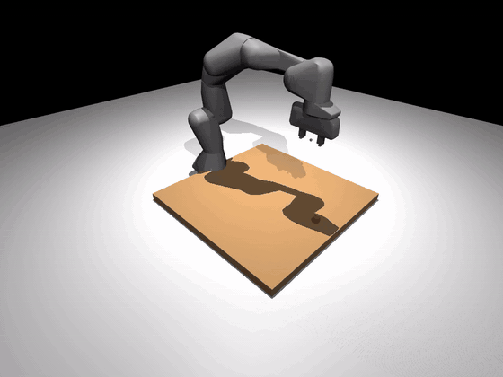

# RoboSandbox

> A sim-first sandbox for robot manipulation.
> **Bring your own arm, objects, and tasks.**

<p align="center">
  
</p>

RoboSandbox is a small manipulation sandbox built around MuJoCo. You
can load a robot from a URDF or MJCF, spawn a few objects, define a
task, run a planner or policy, and record the result. The point is to
make the stack small enough to inspect and easy enough to modify.

## Why RoboSandbox Exists

RoboSandbox exists to make robot manipulation experiments easier to
start.

A lot of robotics tooling is either very low-level or very heavy. If
you are new, that means a steep learning curve before you can make
anything move. If you are experienced, that often means too much setup
just to test one idea.

RoboSandbox sits in the middle. It is a small manipulation sandbox for
learning, prototyping, and integration work. You can run it, read it,
and modify it without committing to a heavyweight simulation workflow.

This project is intentionally a starting point, not an end state. The
goal is not to replace MuJoCo, Isaac Sim, LeRobot, or your team's
internal stack. The goal is to help you get oriented, get something
working, and make the seams visible before you invest in a larger
system.

If you start with RoboSandbox and later move to MuJoCo, Isaac Sim,
LeRobot training workflows, or real hardware, that is success, not
failure.

## Who It Helps

RoboSandbox is useful for three kinds of users.

**If you are new to robotics**
Use it to learn how a manipulation stack fits together. You can start
with a working example, then trace the path from task text to skills to
motion to recorded artifacts without getting buried in framework
complexity.

**If you already do robotics but not simulation**
Use it as a fast prototyping environment. It is a lightweight place to
test a robot, task, recorder, or policy integration without first
committing to a heavyweight simulator workflow.

**If you already use simulation tools**
Use it as a small integration harness. It is a good place to isolate
interface questions, build minimal reproductions, and validate a seam
before moving the idea into MuJoCo, Isaac Sim, or your internal stack.

## When To Use It

Use RoboSandbox when you want to:

- learn how a manipulation stack works end to end
- prototype a new robot, task, or policy quickly
- test recording, export, and replay workflows
- debug interface contracts in a small environment
- build a minimal reproducible manipulation demo

You will probably want a heavier stack when you need:

- photorealistic rendering
- richer sensor simulation or domain randomization
- large scenes, many assets, or multi-robot setups
- industrial-scale simulation workflows
- production-grade deployment infrastructure

That is the intended progression: start here, learn the workflow,
validate the idea, then graduate when the problem demands it.

If you're new to the repo, start with these:

- [How it works in 3 minutes](docs/site/docs/guides/how-it-works.md) — the four-layer architecture
- [Running the agent](docs/site/docs/guides/agent-runs.md) — CLI entry points, recorded artifacts, provider switch
- [Bring your own robot](docs/site/docs/guides/bring-your-own-robot.md) — URDF + sidecar YAML
- [Bring your own object](docs/site/docs/guides/bring-your-own-object.md) — YCB meshes + BYO OBJ
- [Bring your own task](docs/site/docs/guides/bring-your-own-task.md) — author a task YAML, randomize, score
- [Add a skill](docs/site/docs/guides/add-a-skill.md) — extend the agent's vocabulary
- [VLM tool-calling](docs/site/docs/guides/vlm-tool-calling.md) — how text becomes `SkillCall`s (runnable walkthrough, no API key needed)
- [Reachability pre-flight](docs/site/docs/guides/reachability.md) — catch bad object placements before physics runs
- [Replan loop](docs/site/docs/guides/replan-loop.md) — ReAct recovery when skills fail

```
user: "pick up the red cube and put it on the green cube"
       │
       ▼
 planner ─► [pick(red_cube), place_on(green_cube)]
       │
       ▼
 perception (VLM or ground truth) locates both in 3D
       │
       ▼
 motion (DLS Jacobian IK + Cartesian interpolation) executes
       │
       ▼
 recorder writes runs/<id>/video.mp4 + events.jsonl
```

## Documentation

The full docs live under [`docs/site/`](docs/site/): concepts, guides,
tutorials, and CLI/API reference. To preview them locally:

```bash
uv pip install -e 'packages/robosandbox-core[docs]'
mkdocs serve -f docs/site/mkdocs.yml          # live preview
mkdocs build --strict -f docs/site/mkdocs.yml # one-shot build
```

If you're reading this on GitHub, start at
[`docs/site/docs/index.md`](docs/site/docs/index.md).

## Status

This is still an early project, but the core shape is there. The main
idea is that most moving parts are narrow `Protocol`s, so swapping in a
different robot, object set, planner, recorder, or policy is a small
integration job instead of a rewrite. The current stack is solid on
pick/push/pour/drawer-style tasks. Stacking is still rougher than the
rest and remains open work.

The [roadmap](docs/site/docs/reference/roadmap.md) is the best place to
see what already ships and what is still deferred.

## Install

> **Linux-first.** v0.1 is developed, CI-tested, and regression-gated
> on **Ubuntu 22.04/24.04 with Python 3.11/3.12/3.13**. macOS and
> Windows are not covered by CI — the stack may run, but
> platform-specific issues (OSMesa / EGL headless rendering, Apple
> Silicon MuJoCo wheels, Windows path handling) are not tracked.
> Bug reports from other platforms are welcome; fixes will follow
> the Linux path.

```bash
git clone https://github.com/amarrmb/robosandbox.git
cd robosandbox
uv sync                                 # one-time
uv pip install -e packages/robosandbox-core
```

For the viewer and any test that renders, MuJoCo needs a headless GL
backend. On Ubuntu runners that's a one-time:

```bash
sudo apt-get install -y libosmesa6 libosmesa6-dev libgl1-mesa-dri
export MUJOCO_GL=osmesa    # or `egl` if your machine has it
```

Requires Python 3.10+. MuJoCo 3.2+ comes in as a dep; no GPU needed for
the built-in arm.

## Three ways to try it

### Zero setup: stub planner

```bash
uv run robo-sandbox run "pick up the red cube"
# → plan: [pick(object=red_cube)]
# → MuJoCo opens a 3-cube scene, arm picks the cube
# → writes runs/<timestamp>/{video.mp4, events.jsonl, result.json}
```

This path needs no API key and no model download. The stub planner
handles a small but useful grammar:

- `pick (up) the <obj>`
- `pick (up) the <obj> (and|then|,) (put|place) (it) on (the) <obj2>`
- `stack <obj> on (top of) <obj2>`
- `push the <obj> forward|back|left|right`
- `(go) home`

### Local model: Ollama

```bash
ollama pull llama3.2-vision
ollama serve &
uv run robo-sandbox run --vlm-provider ollama \
  "pick up the blue cube and put it on the green cube"
```

The defaults assume `llama3.2-vision` on `localhost:11434/v1`. Override
with `--model` or `--base-url` if you want something else.

### Hosted model: OpenAI

```bash
export OPENAI_API_KEY=sk-...
uv run robo-sandbox run --vlm-provider openai \
  "stack all three cubes by colour — red on green on blue"
```

`gpt-4o-mini` is the default. If the task is more open-ended or the
plan needs more reasoning, switch to `--model gpt-4o`.

`--vlm-provider custom --base-url https://...` works with together.ai,
vLLM, any OpenAI-compatible endpoint.

## Benchmark

```bash
uv run robo-sandbox-bench                    # run all default tasks
uv run robo-sandbox-bench --seeds 50         # randomize and aggregate
uv run robo-sandbox-bench --vlm-provider ollama   # use a real VLM
```

Tasks with a `randomize:` block get per-seed perturbations. Seed 0 is
the deterministic baseline. Seeds `>= 1` apply uniform jitter keyed on
the seed, and when you run more than one seed the summary reports
`mean ± stderr`.

There are nine built-in tasks under
`packages/robosandbox-core/src/robosandbox/tasks/definitions/`:

| Task | What it exercises |
|---|---|
| `home` | Skill dispatch with no spatial reasoning |
| `pick_cube` | Single-object pick (core reliability) |
| `pick_cube_franka` | URDF-import path — bundled Franka picks a cube |
| `pick_cube_scrambled` | Pick under per-seed pose/size/mass/rgba randomization |
| `pick_from_three` | Perception disambiguation by colour name |
| `pick_ycb_mug` | Mesh-import path — bundled YCB mug picked by Franka |
| `pour_can_into_bowl` | Long-horizon composite (pick → pour) |
| `push_forward` | Non-pick manipulation, verifies directional displacement |
| `open_drawer` | First articulated primitive — drawer + `OpenDrawer` skill |

There is also `_experimental_stack_two`, which is excluded from default
runs because stacking is still open work.

Each task is just a `Scene`, a natural-language prompt, and a
declarative `SuccessCriterion` checked against the final
`Observation`. There is no custom Python success callback hiding in the
task file.

Results are appended to `benchmark_results.json` locally for regression
tracking. The file is gitignored.

## Architecture

The codebase is deliberately small. Most extension points are plain
`Protocol`s, so the seams are easy to find and reason about.

```
packages/robosandbox-core/
├── src/robosandbox/
│   ├── types.py          Pose, Scene, Observation, Grasp, SkillResult
│   ├── protocols.py      SimBackend, Perception, GraspPlanner,
│   │                     MotionPlanner, RecordSink, VLMClient, Skill
│   ├── sim/              MuJoCo backend (built-in 6-DOF arm + URDF robots)
│   ├── scene/            MJCF builder + URDF/mesh loaders — spawns any Scene into MuJoCo
│   ├── perception/       ground_truth (sim cheat), vlm_pointer (VLM)
│   ├── grasp/            analytic top-down (v0.1)
│   ├── motion/           DLS Jacobian IK + Cartesian interpolation
│   ├── skills/           Pick, PlaceOn, Push, Home, Pour, Tap,
│   │                     OpenDrawer, CloseDrawer, Stack
│   ├── agent/            Planner protocol, VLMPlanner, StubPlanner,
│   │                     ReAct-style Agent with replan loop
│   ├── policy/           Policy protocol + LeRobotPolicyAdapter
│   ├── vlm/              OpenAI-compatible client + JSON recovery
│   ├── recorder/         MP4 + JSONL per episode; `export-lerobot` CLI
│   ├── backends/         RealRobotBackend (sim-to-real Protocol stub)
│   ├── tasks/            Task loader + benchmark runner
│   ├── cli.py            `robo-sandbox` entry point
│   ├── demo.py           Scripted pick (no VLM, no API)
│   └── agentic_demo.py   Full agent loop
└── tests/                Test suite covering types, IK, skills, agent,
                          planner, JSON recovery, VLM pointer projection,
                          URDF import, mesh import, policy adapter,
                          real-backend contract, reachability pre-flight.
```

### Agent loop

```
IDLE → PLAN → EXECUTE (one skill at a time) → EVALUATE →
                   │ success                      │ failure
                   ▼                              ▼
                 next in plan                   REPLAN ─► (max N times)
                   │                              │
                   ▼                              ▼
                 DONE                           FAILED
```

One important seam is the planner:

```python
class Planner(Protocol):
    def plan(
        self,
        task: str,
        obs: Observation,
        prior_attempts: list[dict],
    ) -> tuple[list[SkillCall], int]:
        """Returns (plan, n_model_calls). Empty plan == 'already done'."""
```

`VLMPlanner` talks to an OpenAI-compatible endpoint with tool-calling
and image input. `StubPlanner` is a regex parser.

### Skills as tools

Each skill exposes `name`, `description`, and a JSON
`parameters_schema`. `VLMPlanner` turns that into tool definitions; the
model's tool calls become skill dispatches. If you want to add a skill,
you register it at the `robosandbox.skills` entry point.

## Roadmap

The detailed shipped/deferred breakdown lives in
[`docs/site/docs/reference/roadmap.md`](docs/site/docs/reference/roadmap.md).
The short version: better stacking, collision-aware planning, a cleaner
real-policy path, and a concrete SO-101 hardware backend are the main
next steps.

## Browser live viewer

Install the optional extra and open a browser — you'll see MuJoCo render
in real time and can kick off tasks from a dropdown.

```bash
uv pip install -e 'packages/robosandbox-core[viewer]'
robo-sandbox viewer
# → open http://localhost:8000
```

Pick a task, click Run. Events log to the sidebar; frames stream at
~15–50 fps depending on how fast the sim is stepping. Pass
`--task pick_cube_franka` (or any other) to preload a specific scene.
`--host 0.0.0.0` exposes it to other machines on your LAN.

## Bundled assets

### Robots

`assets/robots/franka_panda/` ships a trimmed copy of Franka Emika
Panda adapted from [mujoco_menagerie](https://github.com/google-deepmind/mujoco_menagerie)
under Apache 2.0. Visual meshes removed (collision-only, ~160 KB); the
tendon-driven gripper actuator was replaced with a simple position
actuator on `finger_joint1` so the standard RobotSpec interface
(open_qpos / closed_qpos) applies directly. See `LICENSE` in that
directory for menagerie's attribution.

To bring your own robot:

```python
Scene(
    robot_urdf=Path("/path/to/ur5.urdf"),     # .urdf or .xml
    robot_config=Path("/path/to/ur5.robosandbox.yaml"),  # optional — sibling auto-discovered
    objects=(...),
)
```

The sidecar YAML tells RoboSandbox which joint is the primary finger,
where the end-effector TCP sits, the home pose, and gripper open/closed
qpos. See `packages/robosandbox-core/src/robosandbox/assets/robots/franka_panda/panda.robosandbox.yaml`
for the schema.

### Objects (mesh import)

`assets/objects/ycb/` ships 10 pre-decomposed YCB benchmark objects: a
visual OBJ + N CoACD convex hulls + per-object sidecar YAML each.

| YCB id | Description | Mass (kg) |
|---|---|---|
| `003_cracker_box` | cracker box | 0.411 |
| `005_tomato_soup_can` | tomato soup can | 0.349 |
| `006_mustard_bottle` | mustard bottle | 0.603 |
| `011_banana` | banana | 0.066 |
| `013_apple` | apple | 0.068 |
| `024_bowl` | bowl (hollow; 11 hulls) | 0.147 |
| `025_mug` | mug (handled; 15 hulls) | 0.118 |
| `035_power_drill` | power drill | 0.895 |
| `042_adjustable_wrench` | adjustable wrench | 0.252 |
| `055_baseball` | baseball | 0.148 |

Drop any of them into a task with the `@ycb:` shorthand:

```yaml
objects:
  - id: box_1
    kind: mesh
    mesh: "@ycb:003_cracker_box"
    pose: {xyz: [0.4, 0.0, 0.08]}
  - id: soup
    kind: mesh
    mesh: "@ycb:005_tomato_soup_can"
    pose: {xyz: [0.4, 0.15, 0.06]}
```

Or discover the bundled catalog from Python:

```python
from robosandbox.tasks.loader import list_builtin_ycb_objects
list_builtin_ycb_objects()
# ['003_cracker_box', '005_tomato_soup_can', ..., '055_baseball']
```

See `assets/objects/ycb/LICENSE` for the YCB project's terms.

**Bring-your-own meshes.** The sandbox decomposes user OBJ/STL files
with CoACD and caches the hulls at `~/.cache/robosandbox/mesh_hulls/`:

```bash
uv pip install -e 'packages/robosandbox-core[meshes]'    # pulls in coacd
```

```python
SceneObject(
    id="widget",
    kind="mesh",
    mesh_path=Path("/abs/path/to/widget.obj"),
    collision="coacd",                # or "hull" (skip decomp if mesh is already convex)
    pose=Pose(xyz=(0.4, 0.0, 0.05)),
    mass=0.1,
)
```

`collision="hull"` is a cheap fallback for already-convex meshes — no
CoACD install required, but the sandbox does not compute a hull for
you; it trusts the mesh is convex. For concave objects, always use
`collision="coacd"`.

Pre-decompose a mesh once for a bundled asset with the authoring tool:

```bash
python scripts/decompose_mesh.py \
  --input /path/to/drill.obj \
  --out-dir assets/objects/custom/drill \
  --name drill --mass 0.3 --center-bottom
```

## License

Core: Apache 2.0.

Optional `contrib/` plugins carry their own licenses — research-
licensed grasp predictors etc. live there; they are opt-in installs
and not pulled in by the base source install from
`packages/robosandbox-core`.
