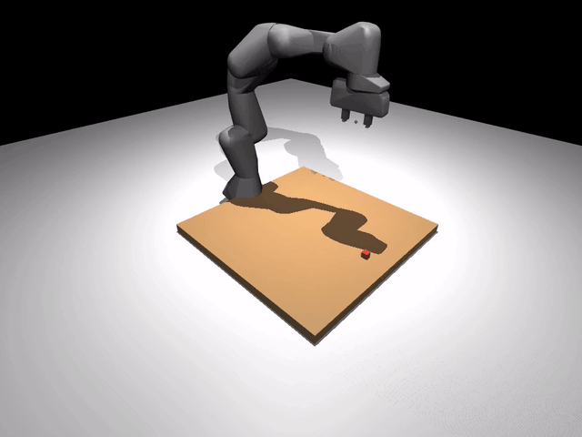

# Add a skill

A skill is the agent's action vocabulary. `Pick`, `PlaceOn`, `Push`,
`Wave` — each is one verb the planner can invoke. Adding one is 30
lines of Python.

{ loading=lazy }

The Franka waving side-to-side. That's a custom `Wave` skill the core
never shipped — written below, dropped into the agent, called. No core
changes.

## The protocol

Every skill satisfies this shape (`robosandbox/protocols.py`):

```python
class Skill(Protocol):
    name: str                  # unique id the planner calls by
    description: str           # one-line English — shown to the VLM
    parameters_schema: dict    # JSON schema for kwargs

    def __call__(self, ctx: AgentContext, **kwargs) -> SkillResult: ...
```

Three class attributes and a `__call__`. The `AgentContext` hands you
the sim, perception, grasp planner, motion planner, and recorder —
everything you need to actually move.

## A minimal skill

```python
# my_wave_skill.py
import math
from robosandbox.agent.context import AgentContext
from robosandbox.types import SkillResult


class Wave:
    name = "wave"
    description = "Wave hello — oscillate the base joint through a few cycles."
    parameters_schema = {
        "type": "object",
        "properties": {
            "cycles": {
                "type": "integer",
                "description": "Number of back-and-forth cycles (default 2).",
                "minimum": 1, "maximum": 10,
            },
        },
        "required": [],
    }

    def __call__(self, ctx: AgentContext, *, cycles: int = 2) -> SkillResult:
        obs = ctx.sim.observe()
        start = obs.robot_joints.copy()
        amplitude = 0.6               # radians of sway on joint 0
        steps_per_cycle = 200
        for i in range(cycles * steps_per_cycle):
            phase = 2 * math.pi * (i / steps_per_cycle)
            target = start.copy()
            target[0] = float(start[0] + amplitude * math.sin(phase))
            ctx.sim.step(target_joints=target)
            if ctx.on_step is not None:
                ctx.on_step()
        return SkillResult(success=True, reason="waved", artifacts={"cycles": cycles})
```

That's the whole skill. 30 lines.

Three things to notice:

1. **`ctx.sim.step(target_joints=...)` is the only way the arm moves.**
   Everything else (perception, IK, grasping) is helpers you don't
   need for a motion primitive.
2. **`ctx.on_step()` callback**, if set by the recorder or viewer, lets
   those layers capture/stream a frame after each sim step. Call it
   every step if you want your skill's motion to show up in recordings.
3. **Return a `SkillResult`.** `success=True/False`, a `reason` slug
   (machine-readable), optional `reason_detail` (human-readable), and
   `artifacts` dict for anything the agent loop might log.

## Invoke it directly

For a motion primitive you want to trigger from Python:

```python
from pathlib import Path
from robosandbox.agent.context import AgentContext
from robosandbox.grasp.analytic import AnalyticTopDown
from robosandbox.motion.ik import DLSMotionPlanner
from robosandbox.perception.ground_truth import GroundTruthPerception
from robosandbox.recorder.local import LocalRecorder
from robosandbox.sim.mujoco_backend import MuJoCoBackend
from robosandbox.tasks.loader import load_builtin_task
from my_wave_skill import Wave

task = load_builtin_task("pick_cube_franka")
sim = MuJoCoBackend(render_size=(720, 960), camera="scene")
sim.load(task.scene)
for _ in range(100): sim.step()  # settle

ctx = AgentContext(
    sim=sim,
    perception=GroundTruthPerception(),
    grasp=AnalyticTopDown(),
    motion=DLSMotionPlanner(),
    recorder=LocalRecorder(Path("runs")),
)

result = Wave()(ctx, cycles=3)
print(result.success, result.reason)
# True waved
```

That's the shortest path from a new skill file to seeing it run.

## Expose it to the planner

For the agent loop to invoke it from a natural-language task, add the
skill to the `skills=` list you pass to `Agent`:

```python
from robosandbox.agent.agent import Agent
from robosandbox.agent.planner import VLMPlanner
from robosandbox.skills.pick import Pick
from robosandbox.skills.place import PlaceOn
from my_wave_skill import Wave

skills = [Pick(), PlaceOn(), Wave()]   # Wave now in the vocabulary
planner = VLMPlanner(vlm_client, skills=skills)
agent = Agent(ctx, skills=skills, planner=planner)
agent.run("wave hello then pick up the red cube")
```

`VLMPlanner` feeds each skill's `name` / `description` /
`parameters_schema` to the model as an OpenAI tool definition. The
model will call `wave({"cycles": 3})` when appropriate.

`StubPlanner` doesn't auto-discover — it uses a fixed regex grammar. If
you want stub-planner coverage, either extend its grammar (see
`agent/planner.py`) or write a tiny custom planner that maps your
task strings to `SkillCall("wave", {...})`.

## Ship it as a plugin package

When your skill outgrows one file, package it like this:

```toml
# pyproject.toml of robosandbox-wave/
[project.entry-points."robosandbox.skills"]
wave = "robosandbox_wave:Wave"
```

Anyone who `pip install robosandbox-wave` gets the skill auto-discovered
by any code that loads the `robosandbox.skills` entry-point group. This
is how the bundled `Pick`, `PlaceOn`, `Push`, `Home`, `Pour`, `Tap`,
`OpenDrawer`, `CloseDrawer`, `Stack` are all registered (see
`packages/robosandbox-core/pyproject.toml`).

## Design tips

**One verb, one skill.** `Pick` picks; it doesn't also place. Small
skills compose; giant skills are un-plannable.

**Fail loudly.** If perception doesn't find the object, return
`SkillResult(success=False, reason="object_not_found")` so the agent can
see it and replan. Don't silently succeed on a bad input — the verify
step downstream will just log confusing "rose 0mm" failures.

**Verify the post-condition.** `Pick` checks the object rose 50 mm
before returning success. `Wave` is a motion primitive with no
post-condition worth checking, so it just returns success. Pick the
right level for your skill.

**Call `ctx.on_step()` inside long motions.** Without it, the viewer
freezes until the skill returns and the recorder captures nothing —
your skill will look instantaneous or get cropped out of videos.

## What's next

- [Bring your own robot](./bring-your-own-robot.md) — different URDF, same skills.
- [Bring your own object](./bring-your-own-object.md) — different mesh, same skills.
