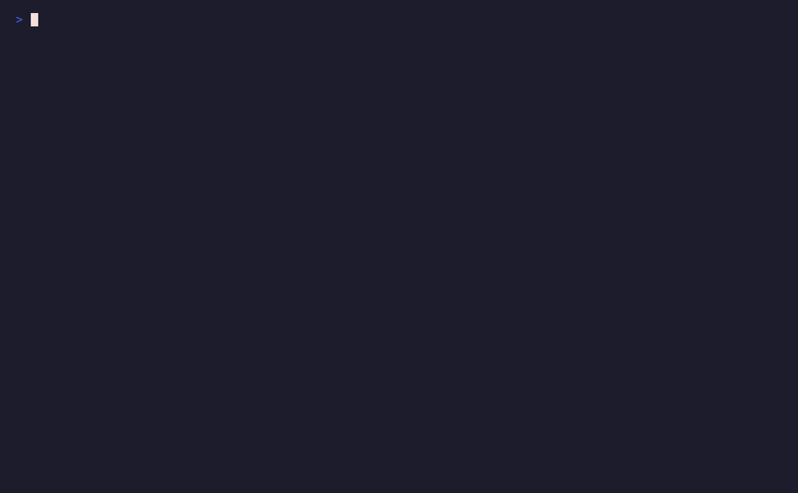

# Running the agent

There are three main ways to run RoboSandbox. They share the same agent
loop; the differences are in how interactive they are and what they
write to disk.

{ loading=lazy }

<video controls preload="metadata" playsinline style="width: 100%; border-radius: 12px; margin: 1rem 0;">
  <source src="../assets/demos/robosandbox_deep_dive_run_inspect.mp4" type="video/mp4">
</video>

## The three ways to run

| Entry point | When to reach for it | What it writes |
|---|---|---|
| **`robo-sandbox-bench`** | Reproducible test runs with success tracking | `benchmark_results.json` |
| **`robo-sandbox viewer`** | Interactive exploration + recording on demand | `runs/<id>/{video.mp4, events.jsonl, result.json}` *(when Record is on)* |
| **`robo-sandbox run`** | One-off scripted run from the CLI | `runs/<id>/{video.mp4, events.jsonl, result.json}` |

All three use the same `Agent` loop and the same skills.

## The fastest successful pick

```bash
uv run robo-sandbox-bench --tasks pick_cube_franka --seeds 1
```

This is the quickest way to confirm the stack is working:

```
TASK               SEED  RESULT   SECS  REPLANS DETAIL
------------------------------------------------------------------------
pick_cube_franka   0     OK        1.6        0 dz_mm=166.905, min_mm=50.000

SUMMARY: 1/1 successful
```

Bench runs are headless: no window, no video. Use the **viewer** or
`robo-sandbox run` if you want recorded artifacts.

## Running from the viewer

```bash
uv run robo-sandbox viewer --task pick_cube_franka
# open http://localhost:8000
```

If this is your first time using the repo, the viewer is the best place
to start. Click **Record**, click **Run**, and then use the
**Inspector** slider to scrub back through the episode.

## What's in `runs/<id>/`

{ loading=lazy }

```
runs/20260418-230155-4471d060/
├── episode.json      # 4 lines: episode_id, task, started_at, sim_dt
├── events.jsonl      # one line per sim step: joints, ee_pose, objects, gripper
├── result.json       # verdict: success, frames, wall, reason
└── video.mp4         # 30 fps render of the agent's camera
```

`result.json` is the high-level summary:

```json
{
  "episode_id": "4471d060",
  "success": true,
  "ended_at": "2026-04-18T23:02:30.623",
  "frames": 1656,
  "task": "pick_cube_franka",
  "wall": 26.29,
  "reason": "plan_complete"
}
```

`events.jsonl` is the raw per-tick stream that policy and export code
consume. Each line is one sim tick (`dt=0.005`s, about 200 Hz):

- `t` — sim time in seconds
- `frame_idx` — zero-based
- `robot_joints` — full DoF vector
- `ee_pose` — `{xyz, quat_xyzw}` in world frame
- `gripper_width` — meters between fingertips
- `objects` — every scene object's current pose
- `action` — what the skill commanded at that tick (if any)

If you want to train from it, convert the run to a LeRobot dataset:

```bash
uv run robo-sandbox export-lerobot runs/<id> datasets/mypolicy
```

## Swapping the planner

`robo-sandbox run` and the viewer both support `--vlm-provider`:

```bash
# regex planner, zero deps (default)
robo-sandbox run "pick up the red cube" --vlm-provider stub

# local Ollama with a vision model
ollama pull llama3.2-vision
ollama serve &
robo-sandbox run "pick up the red cube" --vlm-provider ollama

# OpenAI
export OPENAI_API_KEY=sk-...
robo-sandbox run "pick up the red cube" --vlm-provider openai --model gpt-4o-mini

# any OpenAI-compatible endpoint (vLLM, together.ai, groq, ...)
robo-sandbox run "..." --vlm-provider custom --base-url https://... --api-key-env TOGETHER_API_KEY
```

The agent loop stays the same across all four. Only the `Planner`
instance changes. If you want to see exactly what the model sees, the
[VLM tool-calling guide](./vlm-tool-calling.md) walks through it.

## Watching the phases

`PLAN` and `EXECUTE` log lines make the control loop visible:

{ loading=lazy }

```
PLAN:    task='pick up the red cube' replan=0
EXECUTE: pick({'object': 'red_cube'})
TASK               SEED  RESULT   SECS  REPLANS DETAIL
---------------------------------------------------------
pick_cube_franka   0     OK        1.1        0 dz_mm=166.905
```

If a skill fails, you will see `PLAN` again with a larger `replan=N`
counter. That is the recovery loop.

## Reading `result.json` programmatically

```python
import json
from pathlib import Path

for run_dir in sorted(Path("runs").iterdir()):
    r = json.loads((run_dir / "result.json").read_text())
    if r.get("success"):
        print(f"{run_dir.name}  {r['task']}  {r['wall']:.1f}s  {r['frames']} frames")
```

Common values in `result.json.reason`:

| reason | meaning |
|---|---|
| `plan_complete` | every skill in the plan succeeded |
| `already_done` | planner returned empty plan on the first call |
| `replan_exhausted` | `max_replans` hit; see the final skill's detail |
| `vlm_transport` | VLM API error (timeout, auth, rate limit) |
| `stopped_by_user` | viewer Record stopped mid-episode |

## What's next

- [Bring your own task](./bring-your-own-task.md) — author a YAML, run it through the same path.
- [Replan loop](./replan-loop.md) — trace a deliberately failing run.
- [VLM tool-calling](./vlm-tool-calling.md) — what each provider actually sees.
