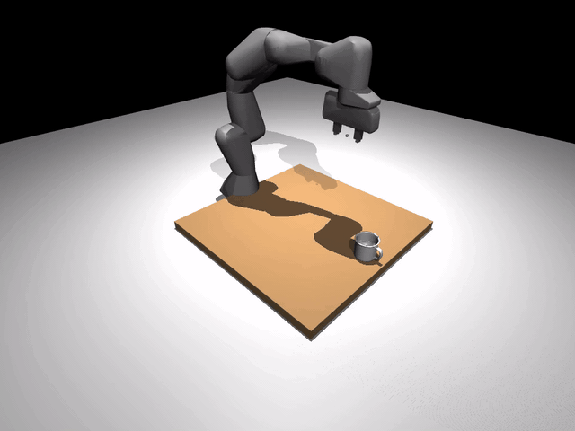
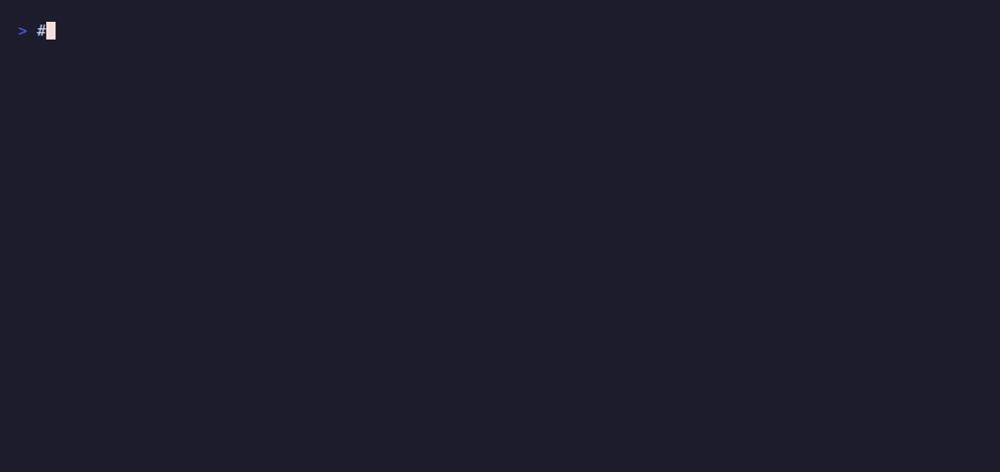

# Bring your own object

You can either use one of the bundled YCB objects or point RoboSandbox
at your own OBJ/STL and let it build collision geometry for you.

{ loading=lazy }

The mug above is a good example of why this matters: it is concave,
handled, and awkward enough that a simple primitive approximation would
not be useful.

## The 10 bundled YCB objects

These ship with RoboSandbox under `assets/objects/ycb/`:

| `@ycb:` id | Object | Mass (kg) |
|---|---|---|
| `003_cracker_box` | cracker box | 0.411 |
| `005_tomato_soup_can` | tomato soup can | 0.349 |
| `006_mustard_bottle` | mustard bottle | 0.603 |
| `011_banana` | banana | 0.066 |
| `013_apple` | apple | 0.068 |
| `024_bowl` | bowl (11 hulls) | 0.147 |
| `025_mug` | mug (handled; 15 hulls) | 0.118 |
| `035_power_drill` | power drill | 0.895 |
| `042_adjustable_wrench` | adjustable wrench | 0.252 |
| `055_baseball` | baseball | 0.148 |

Each one is pre-authored in the repo and referenced with the
`@ycb:<id>` shorthand in task YAML.

## Drop one into a task

```yaml
# tasks/definitions/my_mug_task.yaml
name: my_mug_task
prompt: "pick up the mug"
scene:
  robot_urdf: "@builtin:robots/franka_panda/panda.xml"
  robot_config: "@builtin:robots/franka_panda/panda.robosandbox.yaml"
  objects:
    - id: mug
      kind: mesh
      mesh: "@ycb:025_mug"    # the shorthand — resolves to the bundled asset
      pose:
        xyz: [0.42, 0.0, 0.045]
success:
  kind: lifted
  object: mug
  min_mm: 50
```

Run it:

{ loading=lazy }

```bash
uv run robo-sandbox-bench --tasks pick_ycb_mug --seeds 1
```

Typical output:

```
TASK           SEED  RESULT   SECS  REPLANS DETAIL
----------------------------------------------------------------------
pick_ycb_mug   0     OK        1.2        0 dz_mm=105.272, min_mm=50.000

SUMMARY: 1/1 successful
```

## From Python

```python
from pathlib import Path
from robosandbox.types import Scene, SceneObject, Pose
from robosandbox.tasks.loader import list_builtin_ycb_objects

print(list_builtin_ycb_objects())
# ['003_cracker_box', '005_tomato_soup_can', ..., '055_baseball']

scene = Scene(
    robot_urdf=Path(".../franka_panda/panda.xml"),
    robot_config=Path(".../franka_panda/panda.robosandbox.yaml"),
    objects=(
        SceneObject(
            id="mug", kind="mesh",
            mesh_sidecar=Path(".../ycb/025_mug/mug.robosandbox.yaml"),
            size=(),                          # mesh objects don't use size
            pose=Pose(xyz=(0.42, 0.0, 0.045)),
        ),
    ),
)
```

## Bring your own OBJ/STL

For objects that are not in the bundled YCB set, RoboSandbox decomposes
your mesh with
[CoACD](https://github.com/SarahWeiii/CoACD) and caches the hulls at
`~/.cache/robosandbox/mesh_hulls/`.

### Option A — decompose at runtime

```bash
uv pip install -e 'packages/robosandbox-core[meshes]'    # pulls in coacd
```

```python
from robosandbox.types import SceneObject, Pose

SceneObject(
    id="widget", kind="mesh",
    mesh_path=Path("/abs/path/to/widget.obj"),
    collision="coacd",                        # or "hull" if the mesh is already convex
    pose=Pose(xyz=(0.4, 0.0, 0.05)),
    mass=0.1,
)
```

The first load runs CoACD, which can take a while depending on the
mesh. Later loads hit the cache. If the mesh is already convex,
`collision="hull"` skips decomposition.

### Option B — pre-decompose once

Use `scripts/decompose_mesh.py`, which is the same tool used to author
the bundled YCB assets:

```bash
uv run python scripts/decompose_mesh.py \
  --input /path/to/drill.obj \
  --out-dir assets/objects/custom/drill \
  --name drill \
  --mass 0.3 \
  --center-bottom
```

Output:

```
assets/objects/custom/drill/
├── drill_visual.obj          # original mesh for rendering
├── drill_hull_0.obj          # N convex hulls for collision
├── drill_hull_1.obj
├── ...
└── drill.robosandbox.yaml    # sidecar listing meshes + physics params
```

This is the same general shape as the bundled YCB assets.

## The sidecar schema

A `<name>.robosandbox.yaml` sidecar carries the physics parameters for a
mesh. The bundled mug looks like this:

```yaml
visual_mesh: mug_visual.obj         # relative to sidecar dir
collision_meshes:                    # list of convex hulls — MuJoCo needs these
- mug_hull_0.obj
- mug_hull_1.obj
# ...15 hulls total for the mug
scale: 1.0
mass: 0.118                          # kg
friction: [1.5, 0.1, 0.01]           # tangential, torsional, rolling
rgba: [0.85, 0.85, 0.9, 1.0]
```

## Why convex decomposition?

MuJoCo's contact solver works on convex geoms. A concave object like a
mug will otherwise behave like a much cruder convex hull. CoACD splits
that mesh into convex parts so the physics is usable while the visual
mesh stays the same.

## Troubleshooting

| Symptom | Likely cause |
|---|---|
| "mesh not found: @ycb:..." | Object id typo; run `list_builtin_ycb_objects()` to see valid ids |
| Gripper closes through the object | Used `collision="hull"` on a concave mesh; switch to `collision="coacd"` |
| Object sinks into the table on spawn | `pose.xyz.z` is below the mesh's min-z; re-run `decompose_mesh.py` with `--center-bottom` |
| CoACD runs every boot | Cache miss — check `~/.cache/robosandbox/mesh_hulls/` is writable |

## What's next

- [Bring your own robot](./bring-your-own-robot.md) — the other axis of scene customization.
- [Add a skill](./add-a-skill.md) — teach the agent new verbs.
