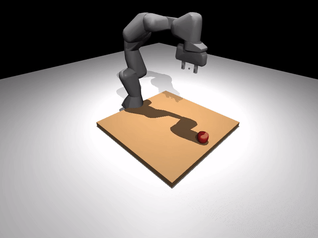
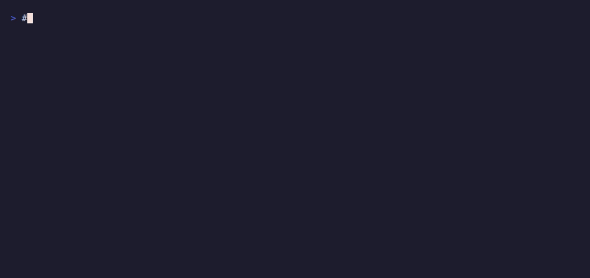

# Bring your own robot

To try a new robot in RoboSandbox, you usually need two things: the
robot description itself and a small sidecar YAML that fills in the
pieces a URDF does not describe.

{ loading=lazy }

The Franka above is loaded through the same path you would use for your
own robot. There is no special-case Franka code in the skill layer.

## Why a sidecar YAML?

A URDF describes geometry and joints. It does **not** say things
RoboSandbox needs to know:

| Question | URDF knows? |
|---|---|
| Which joint is the primary gripper finger? | no |
| Where does the TCP (tool-center point) sit relative to the hand frame? | no |
| What qpos counts as "gripper open" vs "closed"? | no |
| Which pose is "home"? | no |
| Where should the base sit in the workspace? | no |

RoboSandbox reads a `*.robosandbox.yaml` sidecar next to the URDF to
answer those questions. Keeping that information separate means the URDF
can stay close to upstream while the sandbox-specific integration logic
lives in a small, diff-friendly file.

## Run the acceptance test

The easiest way to sanity-check the path is to run the bundled Franka
task end to end:

{ loading=lazy }

```bash
uv run robo-sandbox-bench --tasks pick_cube_franka --seeds 1
```

Expected output:

```
TASK               SEED  RESULT   SECS  REPLANS DETAIL
------------------------------------------------------------------------
pick_cube_franka   0     OK        1.6        0 dz_mm=166.905, min_mm=50.000

SUMMARY: 1/1 successful
```

`dz_mm=166` means the cube rose 166 mm off the table, comfortably above
the 50 mm success threshold.

## The bundled sidecar, annotated

This is the sidecar that ships with the bundled Franka
(`packages/robosandbox-core/src/robosandbox/assets/robots/franka_panda/panda.robosandbox.yaml`).
Read it top to bottom. Every field maps back to one of the questions
above.

```yaml
arm:
  # The 7 arm joints, in IK / trajectory order.
  joints: [joint1, joint2, joint3, joint4, joint5, joint6, joint7]
  actuators: [actuator1, actuator2, actuator3, actuator4, actuator5, actuator6, actuator7]
  # Home pose. Must land the hand in a reachable, non-singular
  # configuration above the table.
  home_qpos: [0.0, 0.0, 0.0, -1.57079, 0.0, 1.57079, -0.7853]

gripper:
  joints: [finger_joint1, finger_joint2]
  primary_joint: finger_joint1     # the one skills drive; the other mirrors
  actuator: actuator8
  open_qpos: 0.04                  # ~80 mm between fingertips
  closed_qpos: 0.0

ee_site:
  # RoboSandbox injects a <site> into the MJCF at this offset from the
  # given body. The Franka TCP is 0.1034 m along +Z from the hand-flange.
  inject:
    attach_body: hand
    xyz: [0.0, 0.0, 0.1034]

base_pose:
  # Where the robot's base sits in the world. Picks the workspace.
  xyz: [-0.3, 0.0, 0.0]
```

That is the whole interface.

## Use your own URDF

There are two normal ways to do this:

### 1. Write a task YAML

Drop your URDF, sidecar, and a task description into a YAML file:

```yaml
# tasks/definitions/my_ur5_pick.yaml
name: my_ur5_pick
prompt: "pick up the red cube"
scene:
  robot_urdf: /path/to/ur5.urdf            # .urdf or .xml (MJCF)
  robot_config: /path/to/ur5.robosandbox.yaml
  objects:
    - id: red_cube
      kind: box
      size: [0.015, 0.015, 0.015]
      pose:
        xyz: [0.5, 0.0, 0.06]
      rgba: [0.85, 0.2, 0.2, 1.0]
      mass: 0.05
success:
  kind: lifted
  object: red_cube
  min_mm: 50
```

Run it:

```bash
uv run robo-sandbox-bench --tasks my_ur5_pick --seeds 1
```

### 2. Build a `Scene` in Python

```python
from pathlib import Path
from robosandbox.types import Scene, SceneObject, Pose

scene = Scene(
    robot_urdf=Path("/path/to/ur5.urdf"),
    robot_config=Path("/path/to/ur5.robosandbox.yaml"),
    objects=(
        SceneObject(
            id="red_cube", kind="box",
            size=(0.015, 0.015, 0.015),
            pose=Pose(xyz=(0.5, 0.0, 0.06)),
            rgba=(0.85, 0.2, 0.2, 1.0),
            mass=0.05,
        ),
    ),
)
```

Then pass the `Scene` to `MuJoCoBackend.load(scene)`.

## Writing the sidecar for a new URDF

Three fields do most of the work:

1. **`arm.joints`** — the DoF chain your IK solver drives. List names
    in proximal-to-distal order.
2. **`ee_site.inject.{attach_body, xyz}`** — where is the "tip" of
    your end-effector? For a parallel gripper this is the point between
    the closed fingertips. IK aims at this point.
3. **`gripper.open_qpos` / `closed_qpos`** — the width at which your
    gripper counts as open vs. closed. Skills like `Pick` call
    `set_gripper(closed=1.0)` and trust your mapping.

The quickest sanity check is to load the task in the viewer and inspect
the scene before you spend time on IK. You want the base placement,
home pose, and tool-center point to look right before you debug
anything else.

## Troubleshooting

| Symptom | Likely cause |
|---|---|
| "Unreachable" on first approach | `home_qpos` is in a singular config; try a slightly bent elbow |
| Gripper opens but nothing grasps | `ee_site.xyz` is offset wrong — IK is aiming next to the fingers, not between them |
| Arm drives through the table | `base_pose.xyz.z` puts the mounting plane below the table; raise it |
| Joint-limit clipping every iteration | sidecar `joints` list skipped one, so IK's DoF count is wrong |

## What's next

- [Bring your own object](./bring-your-own-object.md) — drop a YCB mesh
  or a bring-your-own OBJ into the same scene.
- [Add a skill](./add-a-skill.md) — extend the action vocabulary your
  planner can call.
