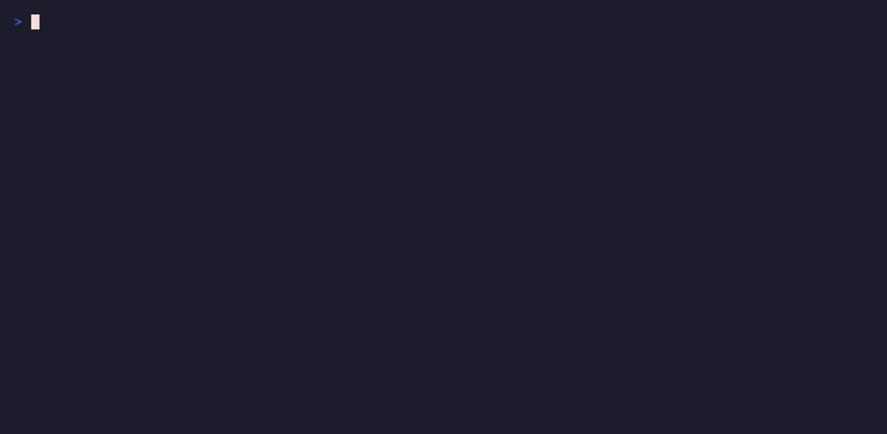

# Bring your own task

A task in RoboSandbox is just a YAML file: scene, prompt, and success
criterion. If you add a `randomize:` block, you also get seeded scene
variation for benchmark runs.

{ loading=lazy }

<video controls preload="metadata" playsinline style="width: 100%; border-radius: 12px; margin: 1rem 0;">
  <source src="../assets/demos/robosandbox_deep_dive_define_task.mp4" type="video/mp4">
</video>

The agent and skill code do not change. You are only changing the task
description.

## The shape of a task

```yaml
name: pick_yellow_cube                              # task id
prompt: "pick up the yellow cube"                   # natural language
seed_note: "User-authored example task."            # free-form metadata

scene:
  robot_urdf: "@builtin:robots/franka_panda/panda.xml"
  robot_config: "@builtin:robots/franka_panda/panda.robosandbox.yaml"
  objects:
    - id: yellow_cube
      kind: box
      size: [0.015, 0.015, 0.015]                   # 15mm
      pose:
        xyz: [0.42, 0.0, 0.06]
      rgba: [0.95, 0.85, 0.15, 1.0]
      mass: 0.05

success:
  kind: lifted                                      # declarative check
  object: yellow_cube
  min_mm: 50

randomize:
  xy_jitter: 0.04                                   # ±4 cm on each axis
  yaw_jitter: 0.52                                  # ±30° about z
```

That is enough to run the task, score it, and regenerate the same setup
from a seed.

The file above lives at
[`examples/tasks/pick_yellow_cube.yaml`](https://github.com/amarrmb/robosandbox/blob/main/examples/tasks/pick_yellow_cube.yaml).

## Run it

The built-in benchmark only knows the bundled tasks by name. For your
own YAML, use the wrapper script:

```bash
uv run python examples/run_custom_task.py \
    examples/tasks/pick_yellow_cube.yaml --seeds 3
```

Output:

```
Task: pick_yellow_cube
Prompt: pick up the yellow cube
Success: lifted (object=yellow_cube)
Seeds: 3

  seed=0  OK   wall=1.2s  reason=plan_complete
  seed=1  OK   wall=1.2s  reason=plan_complete
  seed=2  OK   wall=1.1s  reason=plan_complete

SUMMARY: 3/3 successful
```

The wrapper is short:
[`examples/run_custom_task.py`][wrapper] — it just calls
`load_task(path)` + `jitter_scene(scene, spec, seed)` + the same
`Agent` + `StubPlanner` the bench uses.

[wrapper]: https://github.com/amarrmb/robosandbox/blob/main/examples/run_custom_task.py

### Alternative: copy it into the built-in task dir

If you are working inside a fork and do not mind modifying the repo
tree, you can skip the wrapper:

```bash
cp my_task.yaml packages/robosandbox-core/src/robosandbox/tasks/definitions/
uv run robo-sandbox-bench --tasks my_task --seeds 3
```

## Success criteria

Core ships five declarative success checks in `tasks/loader.py`:

| `kind:` | Check |
|---|---|
| `lifted` | object's z rose ≥ `min_mm` mm |
| `moved_above` | object ended inside `xy_tol` of a target object, above it by ≥ `min_dz` |
| `displaced` | object moved ≥ `min_mm` in a named `direction` (`forward`/`back`/`left`/`right`) |
| `all` | every sub-criterion in `checks:` holds |
| `any` | at least one sub-criterion holds |

Example compound check:

```yaml
success:
  kind: all
  checks:
    - {kind: lifted,       object: widget, min_mm: 30}
    - {kind: moved_above,  object: widget, target: tray, xy_tol: 0.03, min_dz: 0.01}
```

This means "lifted at least 3 cm and ended above the tray." There is no
arbitrary Python callback in the task file.

## Randomization

The `randomize:` block lets each seed vary the scene:

```yaml
randomize:
  xy_jitter: 0.04      # uniform ±4 cm on each of x, y
  yaw_jitter: 0.52     # uniform ±30° about z
```

Seed 0 always produces the declared pose (bit-exact with no
randomize). Seeds ≥ 1 sample deterministic perturbations from the
seed — rerun with the same seed, get the same layout.

When you run multiple seeds, the benchmark reports `mean ± stderr` per
task and writes the results to `benchmark_results.json`.

## Object kinds

The `objects:` list supports four kinds:

```yaml
- id: box_1                   # primitive box
  kind: box
  size: [0.04, 0.04, 0.04]
  pose: {xyz: [0.4, 0.0, 0.02]}

- id: ball                    # primitive sphere
  kind: sphere
  size: [0.025]               # radius
  pose: {xyz: [0.35, 0.1, 0.03]}

- id: mug                     # bundled YCB mesh (see Bring Your Own Object)
  kind: mesh
  mesh: "@ycb:025_mug"
  pose: {xyz: [0.42, 0.0, 0.045]}

- id: drawer_a                # articulated cabinet with handle
  kind: drawer
  size: [0.15, 0.1, 0.06]
  pose: {xyz: [0.5, -0.2, 0.04]}
```

See [Bring your own object](./bring-your-own-object.md) for mesh
import (YCB shorthand + bring-your-own OBJ/STL via CoACD).

## A practical authoring workflow

1. Copy an existing task:
   ```bash
   cp packages/robosandbox-core/src/robosandbox/tasks/definitions/pick_cube_franka.yaml \
      examples/tasks/my_task.yaml
   ```
2. Edit the object layout, prompt, and success criterion.
3. Preview the scene before you run the agent:
   ```bash
   robo-sandbox viewer --task pick_cube_franka   # loads the built-in
   # for your own, copy into the builtin dir first, or open via Python
   ```
4. Run the agent:
   ```bash
   uv run python examples/run_custom_task.py examples/tasks/my_task.yaml
   ```
5. Adjust `randomize:` until seed `0..19` gives you a spread that is
   actually useful.

## What's next

- [Bring your own object](./bring-your-own-object.md) — mesh + custom geometry.
- [Bring your own robot](./bring-your-own-robot.md) — different URDF in the `scene:` block.
- [Replan loop](./replan-loop.md) — what happens when your success criterion fails.
