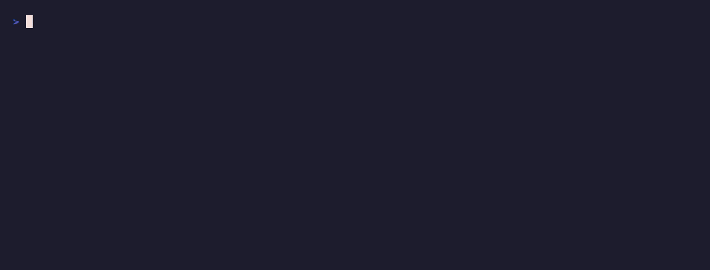

# How it works in 3 minutes

At a high level, RoboSandbox is just a small stack that turns a task
string into calls to `sim.step()`. The pieces are simple, and most of
them are replaceable.

{ loading=lazy }

## The four layers

```
"pick up the red cube"
       │
       ▼
┌──────────────┐
│   Planner    │  text + image → list[SkillCall]
└──────┬───────┘
       │  [SkillCall("pick", {"object": "red_cube"})]
       ▼
┌──────────────┐
│    Skill     │  orchestrates perception → grasp → motion → sim.step
└──────┬───────┘
       │
       ├─► Perception    "red_cube" → 3D point
       ├─► Grasp         3D point → Grasp(pose, width)
       └─► Motion/IK     joint trajectory → sim.step loop
                              │
                              ▼
                         ┌─────────┐
                         │ MuJoCo  │   physics advances one dt=5ms tick
                         └─────────┘
```

| Layer | Input | Output | Where |
|---|---|---|---|
| **Planner** | text + image + prior failures | `list[SkillCall]` | `agent/planner.py` |
| **Skill** | `SkillCall.arguments` | `SkillResult(success, reason, artifacts)` | `skills/*.py` |
| **Motion / IK** | start joints + target pose | `JointTrajectory` | `motion/ik.py` |
| **`sim.step`** | one joint-target vector | advances physics `dt` | `sim/mujoco_backend.py` |

**The important part is that the arm only moves inside `sim.step`.**
Everything above that line is deciding what to do, where to move, or
what joint targets to send next.

## Watch the phases

If you run the benchmark, the agent prints one line per phase:

{ loading=lazy }

```
PLAN:    task='pick up the red cube' replan=0
EXECUTE: pick({'object': 'red_cube'})
TASK               SEED  RESULT   SECS  REPLANS DETAIL
---------------------------------------------------------
pick_cube_franka   0     OK        1.1        0 dz_mm=166.905
```

The happy path is one `PLAN`, one `EXECUTE`, then done. If a skill
fails, the agent appends that failure to `prior_attempts` and plans
again, up to `max_replans=3`.

## Read one pick

The easiest way to understand the stack is to read one skill all the
way through. `skills/pick.py` is short enough to do that:

```python
# 1. Perception: text → 3D point
detected = ctx.perception.locate("red_cube", obs)
target = max(detected, key=lambda d: d.confidence)

# 2. Grasp: 3D point → gripper pose
grasps = ctx.grasp.plan(obs, target)
grasp = grasps[0]
approach = pose_offset_z(grasp.pose, 0.08)           # 8 cm above

# 3. Motion: pose → joint trajectory
traj = ctx.motion.plan(sim, start=obs.robot_joints,
                       target_pose=approach,
                       constraints={"orientation": "z_down"})

# 4. Execute: feed waypoints to sim.step
execute_trajectory(ctx, traj, gripper=0.0)

# Descend Cartesian-linear (not joint-space — avoids swinging the gripper sideways)
traj = plan_linear_cartesian(sim, start_joints, grasp.pose,
                             n_waypoints=60, orientation="z_down")
execute_trajectory(ctx, traj, gripper=0.0)

# Close, lift Cartesian-linear, verify the object rose 50 mm.
set_gripper(ctx, closed=1.0, hold_steps=60)
# ...lift + verify...
return SkillResult(success=True, reason="picked",
                   artifacts={"lifted_m": 0.167})
```

Each step in that path hangs off a `@runtime_checkable Protocol`. That
is why you can swap pieces without rewriting everything around them.

## Why Damped Least Squares IK

MuJoCo already gives you forward kinematics and the Jacobian. The IK
solver in RoboSandbox is the standard Damped Least Squares iteration:

```
dq = Jᵀ(JJᵀ + λ²·I)⁻¹ · err       # apply per iteration
qpos ← qpos + α·dq, clipped to joint limits
```

That is the core of `motion/ik.py`. Add a few retries from different
seed poses plus Cartesian interpolation for straight-line moves, and you
have enough motion for the current pick/place/push tasks on a tabletop.

## The ReAct loop

The agent loop in `agent/agent.py` is also simple:

```
IDLE → PLAN → EXECUTE (one skill) → ok? → next skill
                                │
                                └─ fail? → append to prior_attempts
                                           → REPLAN (≤ max_replans)
                                           → next PLAN with failures fed back
```

The planner does not need to know whether it is a regex parser
(`StubPlanner`) or a VLM (`VLMPlanner`). The agent does not care which
skill implementation it is calling. Each layer only sees the one below
it.

## Plug in your own piece

The extension points all live in `protocols.py`:

```python
SimBackend, Perception, GraspPlanner, MotionPlanner, RecordSink,
VLMClient, Skill, Planner
```

A plugin that implements one of these Protocols can be passed into the
same call sites as the built-in implementation. For example, if you
want a different grasp planner, you pass a different `GraspPlanner`
into `AgentContext`. `SimBackend` and `MotionPlanner` are the biggest
surfaces; most of the others are a method or two.

One concrete caveat: swapping `SimBackend` is easy for observation+step
paths, but anything that reads MuJoCo's kinematic model still needs
either a backend that exposes that model or a different
`MotionPlanner`.

## What's next

- [Bring your own robot](./bring-your-own-robot.md) — swap the URDF.
- [Bring your own object](./bring-your-own-object.md) — drop in a YCB mesh or any OBJ.
- [Add a skill](./add-a-skill.md) — extend the action vocabulary.
