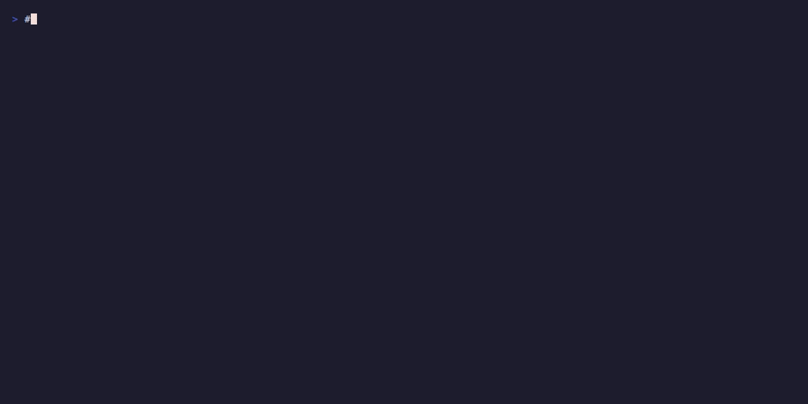

# Reachability pre-flight

Every time a scene loads, RoboSandbox runs a fast kinematic check: can
the configured arm actually reach each object? Warnings print before
any physics runs, so bad placements surface instantly instead of after
four replans.

{ loading=lazy }

## What it checks

For each object in the scene, the checker asks **three** questions,
matching the v0.1 `Pick` skill's own waypoints:

| Phase | Target | Why it matters |
|---|---|---|
| `approach` | object center + 11.3 cm above, palm-down | Must be reachable to start a pick |
| `grasp` | object center + 1.3 cm above, palm-down | The actual grip pose |
| `lift` | object center + 19.3 cm above, palm-down | Must be reachable to pass the 50 mm success criterion |

Each target is fed to the same `DLSMotionPlanner` that `Pick` uses at
runtime (multi-seed retries, joint-limit clipping, z-down orientation).
If IK doesn't converge from the home pose within 400 iterations, the
object is flagged with the first failing phase.

## What a warning looks like

```
reachability: 1 unreachable object(s):
  - red_cube: approach target (1.200, 0.000, 0.173) — IK (none) did not converge
    in 400 iters (pos_err=0.6064m > tol=0.001m)
```

Three things the warning tells you:

1. **Which object** — `red_cube`
2. **Which phase failed first** — `approach` (before grasp, before lift)
3. **How far off IK was** — `pos_err=0.6064m`: 60 cm short. Huge number
   means structurally out of reach; a few centimeters means the grasp
   is at the edge of the workspace and may succeed with different IK
   seeds at runtime.

## When it fires

Four entry points print reachability warnings automatically:

- `robo-sandbox run "pick up the red cube"` — prints before the agent
  loop starts.
- `robo-sandbox-bench` — prints one warning block per task (once, at
  task load, not per seed).
- `examples/run_custom_task.py` — between the task summary and the
  seed loop.
- Programmatic use — call
  `from robosandbox.scene.reachability import check_scene_reachability`
  and do what you like with the returned `list[UnreachableObject]`.

Warnings **do not abort**. The agent runs anyway — surprises are a
legitimate test case, and kinematics is not the only reason a pick
fails. Fail-fast is the agent's replan loop's job.

## Programmatic use

```python
from pathlib import Path
from robosandbox.scene.reachability import check_scene_reachability, format_warnings
from robosandbox.tasks.loader import load_task

task = load_task(Path("path/to/my_task.yaml"))
warnings = check_scene_reachability(task.scene)

if warnings:
    print(format_warnings(warnings))
    # decide: skip? adjust positions? run anyway?
```

Each warning is an `UnreachableObject`:

```python
@dataclass(frozen=True)
class UnreachableObject:
    id: str                                  # scene-object id
    first_failed_phase: str                  # 'approach' | 'grasp' | 'lift'
    target_xyz: tuple[float, float, float]   # world-frame IK target that failed
    detail: str                              # full error from the IK solver
```

## What it doesn't catch

Kinematics isn't physics. The pre-flight check:

- **Checks reach from the home pose only.** If the arm has already
  moved (e.g. for a second pick in a multi-step task), feasibility
  from that pose can differ.
- **Ignores collisions.** A reachable pose may still fail because a
  fingertip sweeps through a neighboring cube on the way down.
- **Ignores gripper width.** A graspable object may still slip if the
  grasp planner picks a width too wide for friction.
- **Ignores dynamics.** Heavy objects, low friction, accidental
  contacts — all show up only at runtime.

For those, the `Agent` replan loop is your safety net. See the
[replan loop guide](./replan-loop.md).

## Tuning

The defaults match the Pick skill's geometry. If you're using a custom
skill with different approach/lift distances, pass them explicitly:

```python
check_scene_reachability(
    scene,
    grasp_height_offset=0.02,   # bigger offset — for taller grippers
    approach_offset=0.15,       # farther approach
    lift_height=0.10,           # shorter lift — enough to clear neighbors
)
```

## Skipped object kinds

`drawer` objects are skipped — they use `OpenDrawer` / `CloseDrawer`,
not `Pick`. Reachability of a drawer body isn't the same as
pickability. Add more exemptions in `reachability.py:check_scene_reachability`
if you introduce object kinds that don't participate in top-down
grasps.

## What's next

- [Bring your own task](./bring-your-own-task.md) — authoring a YAML.
  Reachability warnings fire on first load.
- [Bring your own object](./bring-your-own-object.md) — dropping in
  meshes at positions the arm can actually reach.
- [Replan loop](./replan-loop.md) — the runtime recovery path for
  failures reachability doesn't catch.
