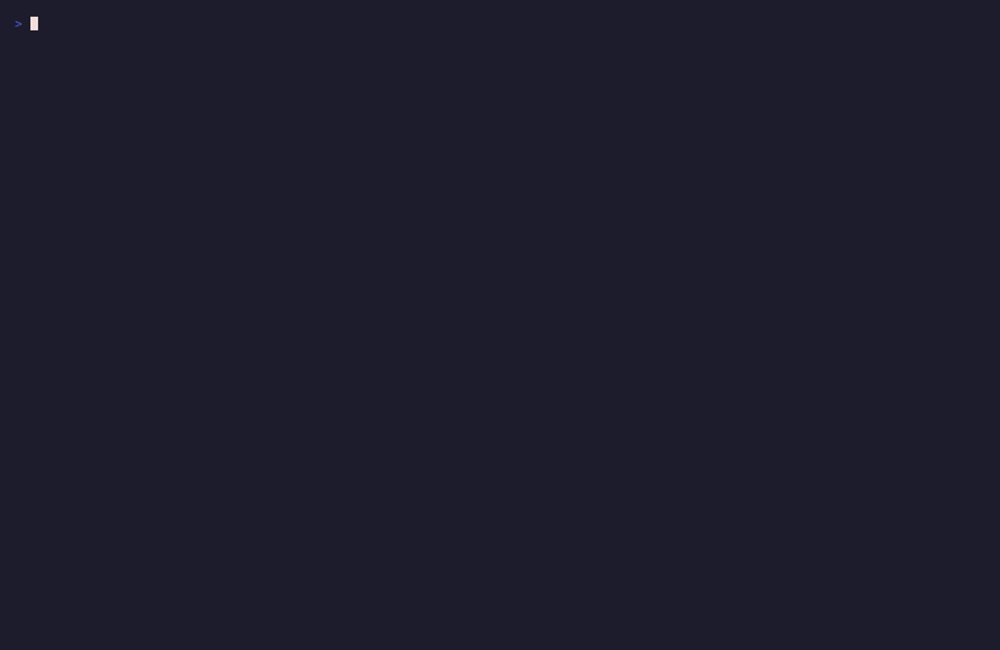

# Tutorial — LeRobot Export

Turn a recorded pick episode into a LeRobot v3 dataset in three
commands. This is the first of three tutorials in the LeRobot workflow
track; it proves the data path is real and self-contained (no policy
quality, no hardware, no checkpoint assumptions).

{ loading=lazy }

## What this tutorial proves

- RoboSandbox can record a successful episode and writes the raw
  artefacts (`episode.json`, `events.jsonl`, `video.mp4`, `result.json`)
  per run.
- `robo-sandbox export-lerobot` converts those into the exact
  [LeRobot v3 dataset layout](https://huggingface.co/docs/lerobot).
- The resulting dataset is loadable with vanilla PyArrow and
  HuggingFace `datasets`; no RoboSandbox imports needed downstream.

Nothing downstream is in play here — not policies, not robots. Just:
is the data legible.

## The three commands

```bash
# 1. Record one pick episode (sim-first, zero hardware)
uv run python examples/record_demo.py --out-dir runs

# 2. Export it to LeRobot v3 layout
RUN=$(ls -1t runs/ | head -1)
uv run robo-sandbox export-lerobot runs/$RUN datasets/pick_demo

# 3. Inspect what got written
uv run python examples/inspect_lerobot_dataset.py datasets/pick_demo
```

That's it.

## What `robo-sandbox export-lerobot` writes

```
datasets/pick_demo/
├── meta/
│   ├── info.json              # codebase version, features, fps, splits
│   ├── tasks.jsonl            # one line per task (task_index → text)
│   └── episodes.jsonl         # one line per episode (index, tasks, length)
├── data/
│   └── chunk-000/
│       └── episode_000000.parquet   # per-frame state + action + timestamps
└── videos/
    └── chunk-000/
        └── observation.images.scene/
            └── episode_000000.mp4   # reference-only; parquet points at this
```

Five files, one per concept.

### The frame table (`.parquet`)

One row per sim tick. Columns:

| column | type | shape | meaning |
|---|---|---|---|
| `observation.state` | float32 | `[state_dim]` | `concat(robot_joints, [gripper_width])` |
| `action` | float32 | `[state_dim]` | recorded action vector, or `observation.state` as fallback for scripted demos |
| `timestamp` | float32 | `[1]` | seconds since episode start |
| `frame_index` | int64 | `[1]` | zero-based per episode |
| `episode_index` | int64 | `[1]` | always 0 for single-episode exports |
| `index` | int64 | `[1]` | global row index (same as `frame_index` for 1-episode sets) |
| `task_index` | int64 | `[1]` | links each frame to a task in `tasks.jsonl` |

**`state_dim` = arm DoF + 1 for the gripper width.** For the bundled
Franka that's 7 + 1 = 8; for the built-in 6-DOF arm that's 6 + 1 = 7.

**Action fallback:** when episodes are generated by scripted skills
(no teleop), the per-frame `action` field is often absent from
`events.jsonl`. The exporter falls back to `observation.state` so
downstream training code never sees a null. Teleoperated episodes
with a real action vector use the recorded values verbatim.

### The video reference (`.mp4`)

`observation.images.scene` is stored as a **video reference** — the
parquet has no image bytes. LeRobot's `VideoFrame` feature type picks
up the matching `.mp4` by convention. H.264, 30 fps, same pixel
dimensions as whatever `MuJoCoBackend.render_size` was set to during
recording.

### The metadata (`info.json`)

```json
{
  "codebase_version": "v3.0",
  "robot_type": "unknown",
  "total_episodes": 1,
  "total_frames": 89,
  "fps": 30,
  "splits": {"train": "0:89"},
  "features": {
    "observation.state": {"dtype": "float32", "shape": [8],
      "names": ["joint_0", "joint_1", "joint_2", ..., "joint_6", "gripper"]},
    "action":            {"dtype": "float32", "shape": [8], "names": [...]},
    "observation.images.scene": {"dtype": "video", "shape": [0, 0, 3],
      "video_info": {"video.fps": 30.0, "video.codec": "h264"}},
    ...
  }
}
```

`robot_type` is the one field not auto-filled — set it yourself when
publishing a dataset intended for a specific embodiment.

## What the inspector prints

`examples/inspect_lerobot_dataset.py` reads the metadata files + first
parquet chunk and prints a one-page summary. Sample:

```
Dataset:        datasets/pick_demo
LeRobot:        v3.0
Episodes:       1
Total frames:   89
fps:            30

State dim:      8
Action dim:     8
State names:    ['joint_0', ..., 'joint_6', 'gripper']
Video key:      observation.images.scene  (h264, 30 fps)

Tasks (1):
  [0] 'pick up the apple'

Episodes (1):
  episode_000000  length=89  tasks=['pick up the apple']

Frame table: datasets/pick_demo/data/chunk-000/episode_000000.parquet
  rows:    89
  columns: ['observation.state', 'action', 'timestamp', 'frame_index', ...]
```

If your values look weird — state dim unexpected, frame count
suspicious, action == state for every row — that's the layer where
problems surface *before* they become training-time mysteries.

## Load it with vanilla tools

Skip the RoboSandbox import. The dataset is standard-compliant:

```python
import pyarrow.parquet as pq

table = pq.read_table("datasets/pick_demo/data/chunk-000/episode_000000.parquet")
print(table.column_names)          # ['observation.state', 'action', ...]
print(table.num_rows)              # 89
first_state = table["observation.state"][0].as_py()  # list[float] of length 8
```

Or with HuggingFace `datasets`:

```python
from datasets import Dataset
ds = Dataset.from_parquet("datasets/pick_demo/data/chunk-000/episode_000000.parquet")
ds[0]   # dict with observation.state, action, timestamp, ...
```

## Requirements

Working from a repo checkout:

```bash
uv pip install -e 'packages/robosandbox-core[lerobot]'
```

The `[lerobot]` extra brings in `pyarrow ≥ 15`. No other
LeRobot-specific dependencies — the export is plain parquet + json +
mp4.

## Where this tutorial fits

The [policy-replay umbrella](./policy-replay.md) frames the larger
"record → train → deploy" loop. Inside it, three layered demos are in
flight:

1. **LeRobot Export** (you are here) — proves the data path. Ships today.
2. **LeRobot Policy Replay with a pre-trained checkpoint** — in
   progress. The [umbrella tutorial](./policy-replay.md) covers the
   `ReplayTrajectoryPolicy` path today (open-loop replay of a recorded
   trajectory, no training); wiring a real ACT/Diffusion checkpoint
   through `LeRobotPolicyAdapter` is the next tutorial's job.
3. **Sim-to-Real Handoff** — coming. A checklist + backend template
   for taking a sim-validated policy to real hardware.

Each tutorial stands alone. You don't need to have trained a policy to
appreciate this one — the export works for any recorded episode.

## Troubleshooting

| Symptom | Likely cause |
|---|---|
| `pyarrow not found` on export | `uv pip install -e 'packages/robosandbox-core[lerobot]'` |
| `events.jsonl not found` | The source run directory isn't from `LocalRecorder`; check it has all four expected files |
| `state_dim = 7` instead of 8 | Using the 6-DOF built-in arm. Bundled Franka gives 8. |
| Action vector identical to state | Scripted episode (no teleop); fallback behavior — teleop runs record real actions |
| Video looks dark / cropped | `MuJoCoBackend.render_size` at record time was too small; re-record at 480×640+ |
