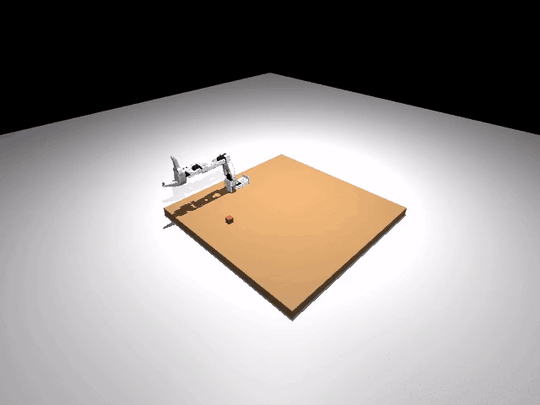
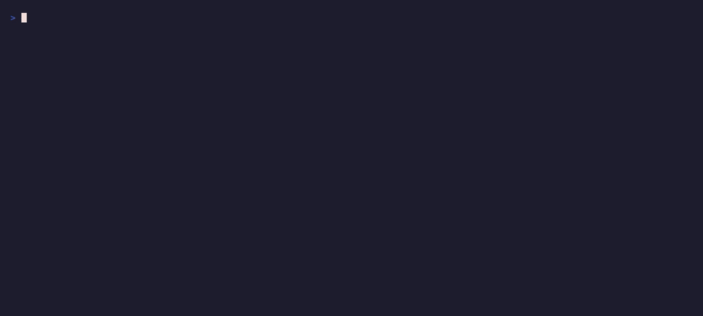

# Tutorial — LeRobot Policy Replay (pre-trained checkpoint)

This page shows what it looks like to take a public LeRobot checkpoint,
wrap it with `LeRobotPolicyAdapter`, and run it through
`robosandbox.policy.run_policy` on a robot that is not bundled with the
core.

!!! warning "What this tutorial is — and isn't"
    This is a policy-integration demo, not a promise that arbitrary
    public checkpoints will work unchanged. The clean path is:

    `LeRobotPolicyAdapter(policy) -> run_policy(sim, adapter)`

    when the checkpoint and sim actually match: same joint count, same
    camera keys, compatible normalization. In this tutorial they do not,
    so the example script uses a small compatibility shim. Treat that
    shim as user-side glue, not as stable API.

{ loading=lazy }

The demo uses a non-bundled SO-ARM100 (from
[mujoco_menagerie](https://github.com/google-deepmind/mujoco_menagerie))
plus
[`satvikahuja/act_so100_test`](https://huggingface.co/satvikahuja/act_so100_test),
a public pre-lerobot-0.5 ACT checkpoint.

The value of the tutorial is not that this exact checkpoint solves the
task. It is that the policy runtime path is real: load a robot, load a
checkpoint, adapt observations into the expected batch shape, and drive
the rollout through `run_policy`.

## The four stages

{ loading=lazy }

The companion script
[`examples/so_arm100/run_so100_policy.py`](https://github.com/amarrmb/robosandbox/blob/main/examples/so_arm100/run_so100_policy.py)
runs all four stages end to end:

```bash
uv run python examples/so_arm100/run_so100_policy.py
```

### 1. Import the non-bundled robot

The SO-ARM100 MJCF + 18 STL meshes live under
[`examples/so_arm100/`](https://github.com/amarrmb/robosandbox/tree/main/examples/so_arm100/)
(Apache-2.0, copied from Menagerie). The hand-authored
`so_arm100.robosandbox.yaml` sidecar (see the
[BYO-robot guide](../guides/bring-your-own-robot.md) for the schema)
declares:

- 5 arm joints: `Rotation`, `Pitch`, `Elbow`, `Wrist_Pitch`, `Wrist_Roll`
- 1 gripper joint: `Jaw`
- `open_qpos=1.5` / `closed_qpos=0.0` — **verified empirically** by
  measuring the pad gap, not guessed
- `home_qpos` placing the gripper over a reach-forward workspace
- Injected `ee_site` at the Fixed_Jaw body with a -10 cm local-Y offset

Coverage in
[`tests/test_so_arm100_import.py`](https://github.com/amarrmb/robosandbox/blob/main/packages/robosandbox-core/tests/test_so_arm100_import.py)
locks the DoF count, joint order, gripper open/closed ordering, and
reachability from home so this stays a real example rather than a
fragile demo asset.

### 2. Download and migrate a public checkpoint

```python
from huggingface_hub import snapshot_download
local = Path(snapshot_download("satvikahuja/act_so100_test", ...))
```

Run
[`examples/so_arm100/probe_hub_schemas.py`](https://github.com/amarrmb/robosandbox/blob/main/examples/so_arm100/probe_hub_schemas.py)
to download `config.json` for a short list of public SO-100 ACT
checkpoints and classify their schema. At the time of writing, all six
checkpoints in the default list
(`cadene/act_so100_5_lego_test_080000`, `satvikahuja/act_so100_test`,
`koenvanwijk/act_so100_test`, `Chojins/so100_test20`,
`pingev/lerobot-so100-1`, `maximilienroberti/act_so100_lego_red_box`)
return `legacy` — they use `input_shapes` + `input_normalization_modes`
rather than the current `input_features`/`output_features` +
`normalization_mapping`, and loading them with current lerobot
crashes with a `DecodingError`. Rerun the probe to pick up new
uploads; extend the `_CHECKPOINTS` list in that script to widen the
sample.

The fix is:
[`examples/so_arm100/migrate_lerobot_config.py`](https://github.com/amarrmb/robosandbox/blob/main/examples/so_arm100/migrate_lerobot_config.py)
rewrites `config.json` in-place. Run it once per checkpoint:

```bash
uv run python examples/so_arm100/migrate_lerobot_config.py /path/to/ckpt/config.json
```

The rollout script above does this automatically on first download.

### 3. Wrap with `LeRobotPolicyAdapter`

```python
from lerobot.policies.act.modeling_act import ACTPolicy
from robosandbox.policy.lerobot_adapter import LeRobotPolicyAdapter

policy = ACTPolicy.from_pretrained(str(local))
policy.eval()

adapter = LeRobotPolicyAdapter(
    policy,
    camera_name="laptop",                 # policy's primary image key
    image_size=(480, 640),                 # policy's expected HxW
    action_dim=7,                          # policy's output dim
)
```

`LeRobotPolicyAdapter` auto-detects torch policies and feeds them torch
tensors; mock policies still receive numpy (see
[`tests/test_lerobot_adapter.py`](https://github.com/amarrmb/robosandbox/blob/main/packages/robosandbox-core/tests/test_lerobot_adapter.py)
for the regression tests).

If your sim and checkpoint match, you stop here. The plain
`LeRobotPolicyAdapter` goes straight into `run_policy`:

```python
from robosandbox.policy import run_policy

out = run_policy(sim, adapter, max_steps=80)
print(out["success"], out["steps"])
```

In this tutorial they do not match, so there is one more step.

#### Cross-embodiment escape hatch

`satvikahuja/act_so100_test` was trained on a robot whose state/action
vector is 7-dim (6 arm joints + gripper) with two cameras (`laptop`
and `phone`). Menagerie's SO-ARM100 exposes 5 arm joints + a gripper
(6-dim) with one scene camera. The dimensions don't line up:

| Dimension | Checkpoint expects | Our sim provides |
|---|---|---|
| Cameras | two — `laptop` + `phone` | one — `scene` |
| State dim | 7 | 6 |

The example script uses a small `DimShimAdapter` that duplicates the
scene frame across both camera keys, zero-pads state 6 → 7, and
truncates the 7-dim action back to 6 before `run_policy` consumes it.
This is a workaround, not a reusable API contract. Read the
[full ~20-line source](https://github.com/amarrmb/robosandbox/blob/main/examples/so_arm100/run_so100_policy.py)
if you want to see the whole thing.

When a checkpoint trained for your exact embodiment lands (same DoF,
same camera keys, same normalization statistics), skip the shim and
drop the vanilla `LeRobotPolicyAdapter` into `run_policy` directly.

### 4. Run via `run_policy` with recording

```python
from robosandbox.policy import run_policy
from robosandbox.recorder.local import LocalRecorder

recorder = LocalRecorder(Path("runs"))
recorder.start_episode(task="so100 rollout", metadata={})

def _frame_hook(obs, action):
    recorder.write_frame(obs)

out = run_policy(sim, adapter, max_steps=80, on_step=_frame_hook)
recorder.end_episode(success=False, result={"steps": out["steps"]})
```

80 steps at sim `dt=0.005` s is about 400 ms of simulated time. The
rollout writes the same `video.mp4 + events.jsonl + result.json`
artifacts as the export tutorial.

## What to look for at each stage

| Stage | Signal |
|---|---|
| Import | `MuJoCoBackend.load(scene)` returns; `sim.n_dof == 5`; reachability pre-flight empty |
| Migrate | `config.json` now has `type`, `input_features`, `output_features` keys |
| Wrap | `ACTPolicy.from_pretrained(local)` succeeds; `policy.config.input_features` matches what the sim will provide |
| Run | Terminal prints `rollout wall: ~3s` with no traceback; `runs/<id>/video.mp4` exists |

## What not to overread

- The cube being lifted. This checkpoint was trained on hardware and
  cameras that do not match the sim here. The arm may move in plausible
  ways without actually completing the task.
- A drop-in replay recipe for arbitrary checkpoints. The general lesson
  here is about the integration path, not about universal compatibility.

## What would it take for this to become a real policy demo?

Three things need to line up for a meaningful policy run in sim:

1. **Embodiment match.** Checkpoint's joint count, joint order, and
   gripper convention must match the sim's URDF. Menagerie's
   `trs_so_arm100` is 5-DoF; most public SO-100 ACT checkpoints were
   trained on 6-DoF SO-101 variants. Bringing in the SO-101 URDF
   collapses that gap.
2. **Camera match.** The checkpoint's image keys (`laptop` / `phone`
   here) need real camera views, not duplicated scene frames. Adding
   a second MuJoCo camera at the right extrinsics is a scene-level
   change.
3. **Normalization match.** The checkpoint's
   `normalization_mapping` ships the mean/std statistics from its
   training distribution. Sim observations that fall well outside
   that distribution produce garbage actions even when plumbing is
   perfect. This is rarely a hard blocker but is often a subtle one.

Those are outside the scope of this page. This tutorial is about the
runtime path, not about claiming successful cross-embodiment transfer.

## Where this fits

In the broader `record -> train -> deploy` story, this is the middle
step:

1. **[LeRobot Export](./lerobot-export.md)** — proves the data path.
2. **LeRobot Policy Replay with a pre-trained checkpoint** (you are
   here) — proves the policy integration under cross-embodiment mismatch.
3. **[Sim-to-Real Handoff](./sim-to-real-handoff.md)** — the
   deployment recipe and SO-101 backend skeleton for taking a
   sim-validated policy or skill to real hardware.

## Requirements

```bash
uv pip install -e 'packages/robosandbox-core[lerobot]'
uv pip install lerobot        # brings torch, torchvision, lerobot's policy code
```

The first line matches the [export tutorial](./lerobot-export.md) and
pulls `pyarrow`. The second is only needed for this page.

Footprint: ~2 GB for torch + torchvision + lerobot dependencies.

## Troubleshooting

| Symptom | Likely cause |
|---|---|
| `ParsingError: Expected a dict with a 'type' key` | Pre-lerobot-0.5 checkpoint; run `migrate_lerobot_config.py` |
| `DecodingError: The fields input_normalization_modes, input_shapes ... are not valid` | Same — the full migration adds `input_features`/`output_features`, not just `type` |
| `TypeError: linear(): ... must be Tensor, not numpy.ndarray` | Older RoboSandbox without the torch-gating fix; pull latest or pin `robosandbox >= <version-with-fix>` |
| `ValueError: LeRobot policy returned action dim N, expected M` | Set `action_dim=N` on the adapter to match the checkpoint's output, then handle the sim mismatch in a shim |
| Arm moves but doesn't grasp | Expected — cross-embodiment policy action quality is not the claim |

## Credits

- SO-ARM100 URDF + meshes: [google-deepmind/mujoco_menagerie](https://github.com/google-deepmind/mujoco_menagerie)
  (`trs_so_arm100`, Apache 2.0).
- Public ACT checkpoint: [`satvikahuja/act_so100_test`](https://huggingface.co/satvikahuja/act_so100_test).
- LeRobot policies: [huggingface/lerobot](https://github.com/huggingface/lerobot).
